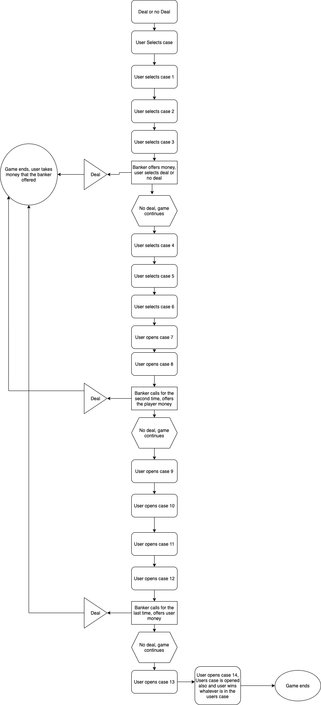

**Deal or No Deal**

**GitHub Repo: [https://github.com/connorflynn08/deal-or-no-deal](https://github.com/connorflynn08/deal-or-no-deal)**

**Description:**

I have made a working version of the popular gameshow "Deal or no deal" that is played through terminal. The game is made from Ruby and uses a series of user inputs and matches them to corresponding data within arrays. The user chooses a numbered case that contains a hidden amount of money behind it, then systematically chooses more cases. The "Banker" will interject at certain points to offer the user a deal in the form of money. The deal may or may not be bigger then the users chosen case, so the user must make a choice on how they'd like to proceed. After all the cases have been opened, the user will open their own case.

**Identify the problem it solves and why you are developing it:**

The problem is that in order to get some quality entertainment on television, you have to wait till 5:30 when Deal or no deal is on, and within half an hour it's over. My solution to this problem was to create the game show through ruby so Deal or no deal can be played at any time, anywhere. I'm developing this game because people should be able to feel the thrill of Deal or no deal whenever they choose to.

**Identify the target audience:**

The target audience for this app is generally everyone. It's quite user friendly, doesn't allow for incorrect inputs from the user, and can be played by anyone who just wants to kill some time or have some fun. There is no set audience, everyone is welcome.

**Explain how the target audience will use it:**

The user will have to have the latest version of ruby available, as well as dependencies that will be included in a prerequisites list. They will download the source code and follow the readme.md instructions to boot up the app, and follow the instructions within the game. The game will prompt the user every time it needs data, and the user will be informed and up to date with their choices and inputs.

**Features**

1\.  Feature one: The first feature of this game is a fully randomized assortment of cases and monetary value behind them. The user is prompted to pick a case between 1 and 15 and the case that is chosen will contain the same value as it had from the start. All cases are assigned their values right from the start of the game, so there's no chance to cheat, or find a cases value before it's been chosen as a user input.

2\.  Feature two: The Banker. The Banker will pop up periodically to offer the player a random amount of money. The user can either choose to input "Deal" or "No deal". If the user takes the deal, the terminal will display the amount of money taken and the game will end. If the user decides that they don't want the deal, the game will continue until the users case is opened or the banker comes back with another deal and the user decides to take it.

3\.  Feature three: Ease of play. The game has deliberately been coded to remember what cases have been opened, remember the values behind the cases and remember the users inputs on whether they want to take deals or not. If the user chooses to open one case, and later down the line forgets they've chosen that one and inputs the same case number, the game will prompt the user to choose another case, as they've already chosen that one before. The same goes for if the user inputs a value bigger then 15 or less than 0 when choosing a case, as well as inputting data regarding to taking a deal or not from the banker.

**Develop an outline of the user interaction experience for the application:**

\* How the user will find out and interact with/ use each feature: The user will be given a paragraph explaining how the game works and how to interact with each feature within the game. There will be also be instructions contained within the readme.

\* How the user will interact with / use each feature:  Whenever the user is required to interact with the games features in any way whatsoever, the game will prompt the user for data in order to progress. The game holds the hand of the user, and requires input to continue playing.

\* How errors will be handled by the application and given to the user: For every single time the user interacts with the game and gives it data to work with, the game is ready to throw back an error message in the event that the data that is given does not correspond to what the game needs. For example, when the banker calls and offers the user a case, the user may enter anything they like, but will continue to get an error message saying "Please enter deal or no deal". Until this requirement is filled, the game will be unable to progress.

**R8 Flowchart: **  


**R9 URL**: [https://trello.com/b/dPBFKKnm/deal-or-no-deal-terminal-app](https://trello.com/b/dPBFKKnm/deal-or-no-deal-terminal-app)

**Installation requirements and instructions**

You will need the latest version of Ruby.

Most Unix based machines will have Ruby preinstalled on them, if not, head to your terminal and type ```sudo install ruby``` for Mac, or ```sudo apt get ruby``` for Ubuntu and Debian. For Windows, head to: [https://rubyinstaller.org/](https://rubyinstaller.org/)

Installation steps: In order to install this game, you must have the Ruby gems 'Colorize', 'Rspec', and 'Ascii-image'.

Colorize: [https://github.com/fazibear/colorize](https://github.com/fazibear/colorize)

Rspec: [https://rspec.info/](https://rspec.info/)

Ascii-image: [https://github.com/nathanpc/ascii-image](https://github.com/nathanpc/ascii-image)

Instructions on how to install gems: [https://guides.rubygems.org/rubygems-basics/\#installing-gems](https://guides.rubygems.org/rubygems-basics/#installing-gems)

You will need to download the source code, which can be found here:

[https://github.com/connorflynn08/deal-or-no-deal](https://github.com/connorflynn08/deal-or-no-deal)

In order to play the game, you must open your terminal, change the directory in your terminal to the folder that contains the game, for example:

```cd Documents/dealornodeal```

This path may be different on your computer, please enter the path that is relevant to you.

Once you're In the dealornodeal folder, type ```ruby dond.rb```

If everything has been done correctly, the game should be loaded.

Hardware requirements:

\* Toaster

\* Literally anything, this game is shell based and doesn't require anything except the software dependencies to run
